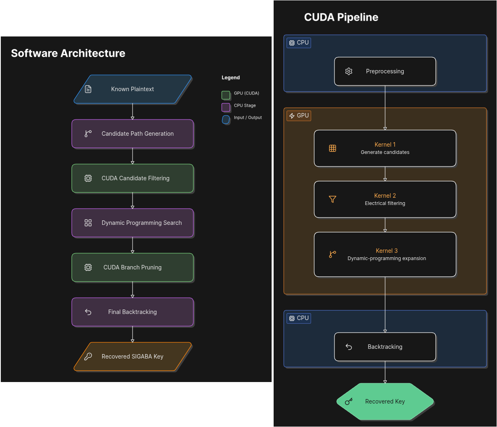

# GPU-Accelerated SIGABA Solver

## Overview

This repository contains a CUDA implementation of a deterministic attack
against the **SIGABA (ECM Mark II)** cipher machine.

The project combines **algorithm design** with **high-performance GPU
computing** to recover complete SIGABA settings from short known
plaintext (crib) using large-scale parallel search.

Unlike previous published approaches that rely on statistical scoring
and long cribs, this implementation performs **deterministic
per-character filtering** using electrical constraints derived from the
internal behavior of the SIGABA index system. The resulting search is
accelerated using multiple NVIDIA GPUs.

The implementation was developed as an independent research project over
approximately seven months.

# Motivation

SIGABA is widely regarded as one of the most secure rotor machines ever
deployed.

Its search space is enormous due to the interaction between

- cipher rotors,
- control rotors,
- index rotors,
- stepping logic.

Existing known-plaintext attacks typically depend on statistical scoring
and require approximately 100 characters or more of known plaintext.

The objective of this project was to investigate whether algorithmic
improvements combined with GPU acceleration could make significantly
shorter cribs practical.

# Key Contributions

This implementation introduces several engineering and algorithmic
improvements.

### Algorithm Design

- Deterministic per-character filtering using two electrical invariants.
- Dynamic-programming search with forward state extension.
- Complete elimination of statistical scoring.
- Fully deterministic candidate reconstruction.
- Automated index-rotor recovery.

### GPU Engineering

- Large-scale CUDA kernel implementation.
- Massive parallel exploration of candidate control-rotor settings.
- Multi-GPU execution across independent search partitions.
- High-throughput state filtering.
- Reproducible execution pipeline.

# Algorithm Overview

The attack consists of three stages.

## Phase 1 --- Candidate Generation

For the first twenty crib characters every feasible cipher path is
generated.

Each candidate control-rotor configuration is evaluated independently on
the GPU.

Electrical constraints immediately eliminate impossible candidates.

Output:

- surviving path
- control rotor candidates

## Phase 2 --- Dynamic Programming

Remaining candidates are extended character by character.

At every position deterministic electrical constraints are verified.

Invalid branches are discarded immediately.

The search rapidly collapses to either

- zero candidates
- exactly one valid solution

without requiring statistical ranking.

## Phase 3 --- Final Recovery

Once the correct path is identified the remaining index-rotor settings
are reconstructed deterministically.

The complete machine configuration is then recovered.

# Why This Approach Works

Instead of comparing distant repetitions in ciphertext, the algorithm
evaluates **every character independently**.

This is possible because of two electrical constraints discovered during
analysis of the INDEX_IN → INDEX_OUT circuitry.

These constraints allow impossible states to be rejected immediately,
producing much stronger pruning than traditional repetition-based
filters.

# Software Architecture

## Performance

| Benchmark | Crib Length | Hardware | Runtime |
|-----------|------------:|----------|---------|
| [JF Bouchaudy Problem 3](http://jfbouch.fr/crypto/challenges/CSP-889/889_problem_03.html) | 100 | 8 × RTX 3070 | 3 h 22 min |
| [JF Bouchaudy Problem 7](http://jfbouch.fr/crypto/challenges/CSP-889/889_problem_07.html) | 50 | 8 × RTX 3070 | 2 h 38 min |

Additional internal benchmarks successfully recovered complete keys from
cribs as short as **39 characters** using the same implementation.

# References

George Lasry et al.

[Jean-François Bouchaudy
Challenges](http://jfbouch.fr/crypto/challenges/CSP-889/index.html)
